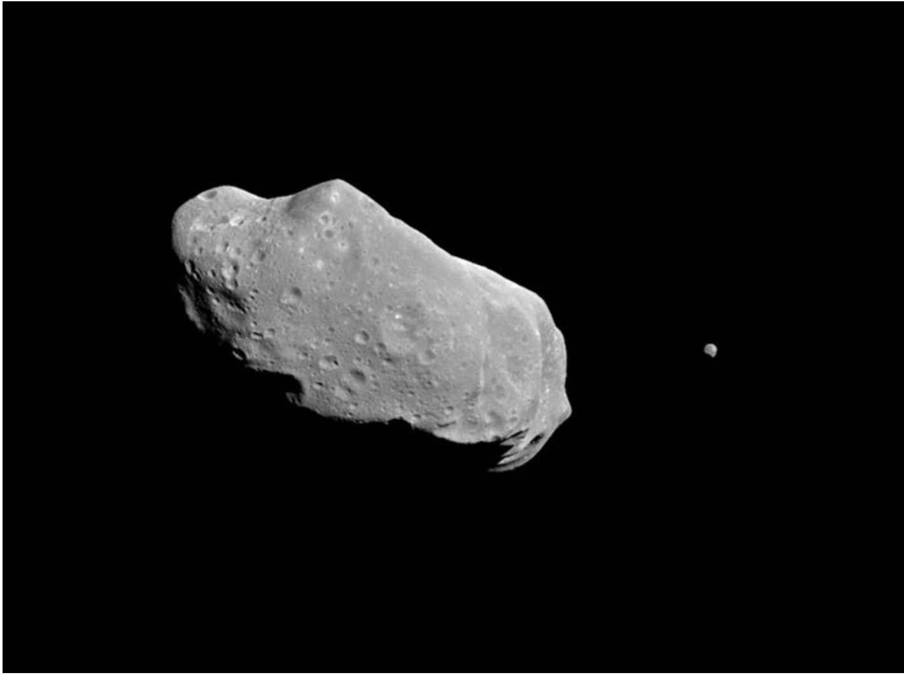
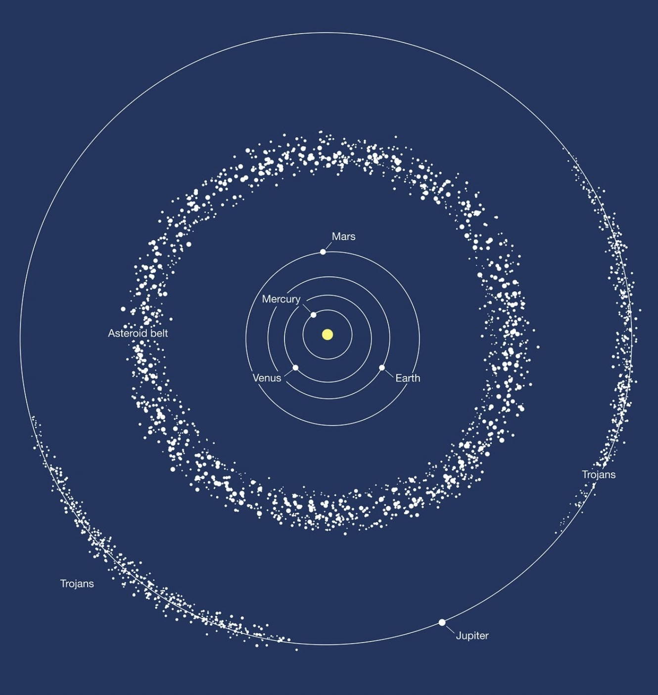

```{r load-packages, include = FALSE}
# Add any additional packages you need to this chunk
library(tidyverse)
library(palmerpenguins)
library(knitr)
library(xaringanthemer)
```

```{r setup, include=FALSE}
# For better figure resolution
knitr::opts_chunk$set(fig.retina = 3, dpi = 300, fig.width = 6, fig.asp = 0.618, out.width = "80%")
```

```{r load-data, include=FALSE}
# Load your data here
asteroid <- read_csv("sbdb_query_results.csv")
```

```{r background1 , include=FALSE}
style_xaringan(
  title_slide_background_image = "bgslide1.png"
)
```


class: inverse, center, middle

# Introduction

Asteroids, sometimes called minor planets, are rocky, airless remnants left over from the early formation of our solar system about 4.6 billion years ago.

```{r asteroid , echo = FALSE, out.width = "55%"}

```
---
class: inverse, center, middle
# Source
-At first, our group found a database on the Internet in which we could find various data about the distance of asteroids relative to the Earth and other data.
- In the database we can select data that we think are relevant to our report and also compare different asteroids to the same kind of data variables. This will make the differences more visible.

```{r datanasa , echo = FALSE, out.width = "55%"}

```
---


# Data
After filtering the relevant properties of the asteroid from the NASA database, we obtained the table below.

```{r datatable , echo = FALSE, out.width = "50%"}

```

---
                                                                                                                          
# Method

- Aim：To discuss is there any difference for us to rank asteroids from closest to furthest by using two properties(semi-major axis & orbital period).

- Premise：Both of these two properties are positively associated to the distance of that asteroid from Earth.

- Method 1: Using semi-major axis relative to Earth, `a`, variable

(1) Order its data from smallest to largest using `arrange()` 
< use "abs" inside：use absolute values because we're not talking about ”direction“，just "distance" >

(2) Taking the first 100 observations using `slice(1:100)`
< we pick a part of the data as example >

--

- like this:
` asteriods_semimajoraxis <- asteroid %>% `

  `arrange(abs(a)) %>%`
  
  `slice(1:100)` #see top 100 to confirm that data displays in ascending order
  
---


- Methods 2: Using Orbital period, `per_y`, variable

(1) Order its data from smallest to largest using `arrange()` function

(2) Taking the first 100 observations using `slice(1:100)`


< Data visualization: after making data frames, we can use ggplot to data more visual>

--


- We can then compare two data sets using `comparedf(dataset1,dataset2)`

If the results are the same, then there is no difference between the two methods; 

If the results are different, we need to find the difference, or if there is a third variable that affects the result.


---


# Plots

```{r recode-species, echo = FALSE}
# In this chunk I'm doing a bunch of analysis that I don't want to present 
# in my slides. But I need the resulting data frame for a plot I want to present.
asteriods_semimajoraxis <- asteroid %>%
   arrange(abs(a)) %>%
  slice(1:100)

```

```{r plot-iris, echo = FALSE}
# Code hidden with echo = FALSE
# Uses modified iris dataset from previous chunk
# Play around with height and width until you're happy with the look
asteriods_semimajoraxis %>%
  ggplot(aes(x = first_obs, y = a), ) +
  geom_hex() +
  labs(title = "Asteroids against time of observation")
```

---

```{r mainbelt , echo = FALSE, out.width = "70%"}

```

---

#Conclusion

- At the end of this project, we would conclude on how many property-based rankings 
agree when analysing asteroid data.
- Furthermore, astronomers use the semi-major axis variable (asteroid-sun distance),a, as the
most reliable property when computing distances between solar system bodies. 
- Hence, using the asteroid dataset, we can construct a 3D distribution map..

```{r flowchart , echo = FALSE, , out.width = "55%"}

```


